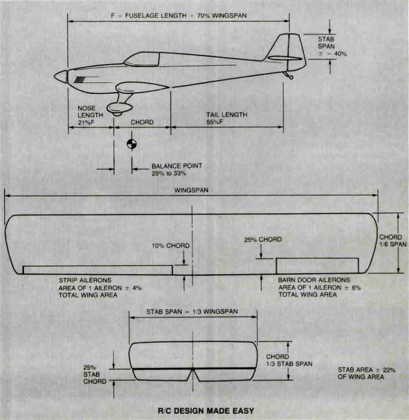

# Aerocalc 
---
AeroCalc is a command line tool that I built to help with my rc plane dimension calculations.  
It was inspired by Chuck Cunningham's RC Design Made Easy guide.  
The guide can be found at [Chuck Cunningham's RC Design Made Easy](https://www.rcuniverse.com/forum/scratch-building-aircraft-design-3d-cad-174/11560594-cunninghams-rcm-design-information.html)  

  

 

If you clone the project and add other features please submit a pull request. :)  
___  

## Usage:  
AeroCalc [option]  [...params]  
AeroCalc [AileronType] [Wingspan] [FuselageLengthModifier] [NoseLengthModifier] [WingRootChordModifier] [WingTipChordModifier] [HStabAreaModifier] [vStabAreaModifier] [Weight]  

Options:  
-h,    --help			Print command line options  
-w,    --wingload		Calculate wingload for a given weight, wingpspan, and aerodynamic mean chord parameters  

Running program without arguments uses default values for airplane settings  
The defaults were designed with a nose mounted propeller in mind.  
If designing a push-prop type plane, modify the nose length to be between 0.45-0.6 of the fuselage length.  
Weight values are in grams and length values are in millimeters.  
The defaults are not set in stone. You can deviate from them a good bit and still end up with a good flying plane when balanced properly.  

## Default values:  
AileronType = -b (-b for barn type ailerons, -s for string type ailerons)
Wingspan = 1200 mm  (Everything starts from a user provided wingspan. I chose 1200mm as a starting point)  
FuselageLength = FuseLenModifier(0...1) - Default is 70% of wingspan  
NoseLength = NoseLenModifier(0...1) - Default is 25% of fuselage length  
WingRootChord = WingRootChordModifier(0...1) - Default is 16.67% of wingspan or 1/6 of wingspan  
WingTipChord = WingTipChordModifier(0...1) - Default is 100% of wingRootChord(for a rectangular wing)  
HorizontalStabArea = HStabAreaModifier(0...1) - Default is 22.5% of winspan area  
HorizonalTipChord = HStabChordModifier(0...1) - Default is 100% of horizontalStabRootChord(for a rectangular wing)
VerticalStabArea = VStabAreaModifier(0...1) - Default is 50% of horizontal stab area  
Weight = 1000 grams (Estimate used for approximating wing load.)  

## Building the project:
Open the folder in Microsoft Visual Studio and click on the build button, you can add the path of the generated executable to the environmental variables and run it directly from the command prompt.  
You can also 'cd' into the folder containing the executable using the command prompt and run it from there.  
An x64 executable has been included for your convenience in [AeroCalc.exe](Release/AeroCalc.exe).
After the airplane is built using the generated measurements, a better wingload estimate can be calculated from the final weight using the -w option.